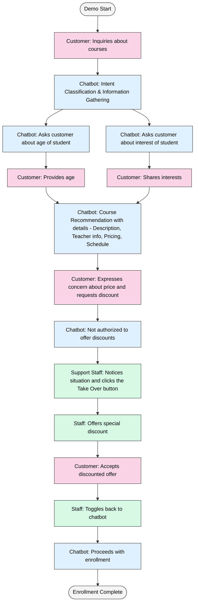
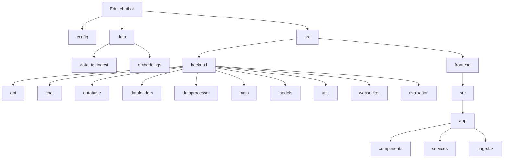

# Edu Chatbot

<div align="center">
  
</div>

Edu Chatbot is a customer service chatbot application, created for education enrichment businesses to auto-reply to customer inquiries. It manages customer inquiries across multiple channels including websites, WhatsApp, WeChat, Telegram, and more.

## Overview & Key Features
Edu Chatbot combines AI technologies with human oversight to ensure customer satisfaction and improve sales conversion:
* **<span style="color:#4285F4">🤖 Intelligent Interaction</span>**: Leverages on Retrieval-Augmented Generation (RAG) to respond to complex customer inquiries, customization according to business needs.

* **<span style="color:#4285F4">📚 Knowledge Base</span>**: Stores and indexes frequently asked questions (FAQs), course details, pricing information, and other business-critical data in a vector database for rapid, accurate retrieval.

* **<span style="color:#4285F4">🎯 Personalized Recommendations</span>**: Gathers relevant student information such as age and interests to recommend the relevant course.

* **<span style="color:#4285F4">🧠 Intent Classification</span>**: Identifies customer needs to provide targeted responses.

* **<span style="color:#4285F4">😊 Sentiment Analysis</span>**: Detects customer satisfaction levels and able to escalate to human staff when reaching a pre-configured threshold.

* **<span style="color:#4285F4">👨‍💼 Human-in-the-Loop Design</span>**: Ensures quality customer service through a sophisticated handoff system that activates when:
    1. A customer explicitly requests to speak with a human representative
    2. The sentiment analysis module detects customer frustration or dissatisfaction
    3. Staff members proactively choose to intervene via the support dashboard

* **<span style="color:#4285F4">🔄 Seamless Handoff</span>**: Enables staff to take over conversations when needed and return control to the chatbot once complex issues are resolved.

* **<span style="color:#4285F4">📱 Dual Interface</span>**: Features a comprehensive demonstration UI with customer-facing chat (left panel) and staff support dashboard (right panel) views.

* **<span style="color:#4285F4">>📊 Comprehensive Evaluation</span>**: A spectrum of evaluation metrics for single-turn and multi-turn conversations. A stimulator to generate datasets for pre-deployment evaluation.

<div align="center">
  
</div>

## Demo
Check out Edu Chatbot in action: [YouTube](https://youtu.be/nDMpLLQesEk)

The diagram below illustrates the complete interaction flow demonstrated in the video:



## Setup

### Prerequisites
* Python version 3.12+
* Docker Desktop

### Installation
1. Clone the repository
```bash
git clone https://github.com/Jeanetted3v/edu_chatbot.git
cd edu-chatbot
```
2. Configure environmental variables
```bash
cp .env.example .env
# Edit .env file with your API keys and configurations
```
3. Start the application using Docker Compose
```bash
docker compose up --build
```
4. Access the application
* Open in a web browser to interact with the [User Interface with "dual interface"](http://localhost:3000) (port 8000)
* Or interact directly with the [Backend](http://localhost:8000/chat/docs) (port 3000)

### Data Configuration - Local
* Place your unstructured FAQ documents (PDF) and structured data Excel files in the /data/data_to_ingest folder
* In config/data_ingest.yaml, configure the paths under "local_docs" according to the file names and excel sheet names
```yaml
local_doc:
  paths:
    - path: ./data/data_to_ingest/excel.xlsx
      sheet: syn_data
    - path: ./data/data_to_ingest/rag_qna.pdf
```
* In config/data_ingest.yaml, configure the chromadb collection name accordingly, default is set to "syn_data"
```yaml
embedder:
  similarity_metric: cosine
  persist_dir: ./data/embeddings
  collection: syn_data
  vector_store: chromadb
```

### Data Configuration - Gdrive (Temporarily disabled)
* Or configure Google Drive access
* Generate and download Google Drive API credentials JSON file
* Place your credentials file in a secure location
* In config/data_ingest.yaml, configure the Google Drive settings:
```yaml
gdrive:
  credentials_path: /path/to/your/credentials.json   # Path to your Google API credentials JSON file
gdrive_doc:
  - file_id: abcd123efg456                           # ID from Google Sheets URL
    file_type: sheets                                # For Google Sheets documents
  - file_id: abcd123efg456                           # ID from Google Docs URL
    file_type: docs                                  # For Google Docs documents
  # - file_id: your_drive_pdf_file_id_here
  #   file_type: pdf   # Support for PDF files (coming soon)
```
* File IDs can be found in Google Drive URLs:
  * For Google Sheets: https://docs.google.com/spreadsheets/d/FILE_ID_HERE/edit
  * For Google Docs: https://docs.google.com/document/d/FILE_ID_HERE/edit
  * For Drive files: https://drive.google.com/file/d/FILE_ID_HERE/view


## Technical Implementation Details
**<span style="color:#4285F4">📏 RAG or Long Context?</span>**
- In view of recent advancement in LLM's context window, this chatbot is set up to use LLM to retreive information if data is within a certain token count. If token count is over a certain number, we'll fall back to use RAG instead. 
- Token count is set as a configurable parameter in config/data_ingest.yaml

**<span style="color:#0F9D58">📂 Loading documents from Local or Google Drive</span>**
- Education company can either load data into Google Drive or locally for both structured and unstructured data ingestion.
- This can be configured in config/data_ingest.yaml

**<span style="color:#F4B400">✂️ Chunking</span>**
- Langchain is used for chunking for the RAG pipeline.
- Currently support RecursiveCharacter and SemanticChunker, configurable in config/data_ingest.yaml

**<span style="color:#DB4437">🔍 Embedding & Vector Database</span>**
- Implements ChromaDB for lightweight, high-performance vector storage.

**<span style="color:#9C27B0">🤖 Agentic RAG</span>**
- PydanticAI is used here for its simplicity and data valiadation feature.
- It is able to provide a more direct output, such as during intent classification process. 
- For other LLM functions, plain vanilla OpenAI API is used for simplicity and flexibility. 

**<span style="color:#FF9800">💾 Saved Chat History</span>**
- All chat histories are saved in MongoDB, which allows for tracing, further analysis and prompt enhancements.

<span style="color:#E91E63">📊 Evaluation</span>
- Metrics include answer relevancy, faithfulness, context precision, answer correctness.
- Conversational metrics are also used here since it involves multi-turn conversations.
- Evaluation results are logged for continuous improvement of the system.


## Future Enhancements
**Multi-Channel Integration**
- Implement direct integration with WhatsApp, WeChat, Telegram, and other messaging platforms
- Develop a unified API layer for consistent experience across all communication channels
- Enable channel-specific customizations while maintaining core functionality

**Vector Database**
- To support more types of vector database

**Enhanced Evaluation**
- To add customized evaluation metrics

## Project Structure
### ASCII Directory Tree (Complete Structure)
```text
Edu_chatbot/
├── assets/
├── config/
├── data/
│   ├── raw/
│   └── embeddings/
├── dockerfiles/
├── src/
│   ├── backend/
│   │   ├── api/
│   │   ├── chat/
│   │   ├── database/
│   │   ├── dataloaders/
│   │   ├── dataprocessor/
│   │   ├── evaluation/
│   │   ├── main/
│   │   ├── models/
│   │   ├── utils/
│   │   └── websocket/
│   └── frontend/
│       └── src/
│           └── app/
│               ├── components/
│               ├── services/
│               └── page.tsx
├── .dockerignore
├── .env
├── .gitignore
├── docker-compose.yml
├── README.md
├── requirements.in
└── requirements.txt
```

### Mermard Diagram (Visual Overview)


### Collapsible sections (With Explanation)

<details>
  <summary><strong>Edu_chatbot (Root)</strong></summary>
  
  - `.dockerignore` - Docker build exclusion patterns
  - `.env` - Environment variables
  - `.gitignore` - Git exclusion patterns
  - `docker-compose.yml` - Docker Compose configuration
  - `README.md` - Project documentation
  - `requirements.in` - Primary Python dependencies
  - `requirements.txt` - Pinned Python dependencies
  
  <details>
    <summary><strong>assets/</strong></summary>
    
  - Project assets (images, static files, etc.)
  </details>
  
  <details>
    <summary><strong>config/</strong></summary>
    
  - Configuration files
  </details>
  
  <details>
    <summary><strong>data/</strong></summary>

  <details>
    <summary>data_to_ingest/</summary>
    
  - Raw data for ingestion
  </details>
  
  <details>
    <summary>embeddings/</summary>
    
  - Vector embeddings storage
  </details>
  </details>
  
  <details>
    <summary><strong>dockerfiles/</strong></summary>
    
  - Docker configuration files
  </details>
  
  <details>
    <summary><strong>src/</strong></summary>
    
  <details>
    <summary>backend/</summary>
    
  - api/ - API endpoints
  - chat/ - Chat functionality
  - database/ - Database connections and models
  - dataloaders/ - Data loading utilities
  - dataprocessor/ - Data processing pipelines
  - evaluation/ - Evaluation pipeline
  - main/ - Application entry points
  - models/ - ML/AI models
  - utils/ - Utility functions
  - websocket/ - WebSocket handlers
  </details>
    
  <details>
    <summary>frontend/</summary>
    
  <details>
    <summary>src/</summary>
    
  <details>
    <summary>app/</summary>
    
  - components/ - UI components
  - services/ - Frontend api
  - page.tsx - Main entry point to frontend components
  </details>
  </details>
  </details>
  </details>
</details>


## Tech Stack

**<span style="color:#4285F4">🧠 OpenAI</span>**: LLM provider for natural language understanding and generation  
**<span style="color:#0F9D58">🔍 PydanticAI</span>**: Agentic framework for data validation and structured outputs   
**<span style="color:#F4B400">⛓️ Langchain</span>**: Document processing and chunking  
**<span style="color:#DB4437">😊 Vadar</span>**: Sentiment analysis  
**<span style="color:#9C27B0">🔠 ChromaDB</span>**: Vector database for semantic search  
**<span style="color:#FF9800">💾 MongoDB</span>**: Chat history storage and data persistence  
**<span style="color:#3F51B5">📁 GoogleDriveAPI</span>**: Remote data access and integration  
**<span style="color:#00BCD4">⚡ FastAPI</span>**: Backend API framework  
**<span style="color:#795548">⚛️ NodeJS/React</span>**: Frontend interface  
**<span style="color:#607D8B">🐳 Docker</span>**: Containerization and deployment  
**<span style="color:#E91E63">📊 RAGAS</span>**: RAG evaluation framework for measuring relevancy, faithfulness, correctness
**<span style="color:#E91E63">📊 DeepEval</span>**: DeepEval evaluation framework for measuring conversational metrics, such as role adherence, knowledge retention, conversation completeness, conversation relevancy


## Contributing
Contributions are welcome! Please feel free to submit a Pull Request.

## License
[MIT License](LICENSE)