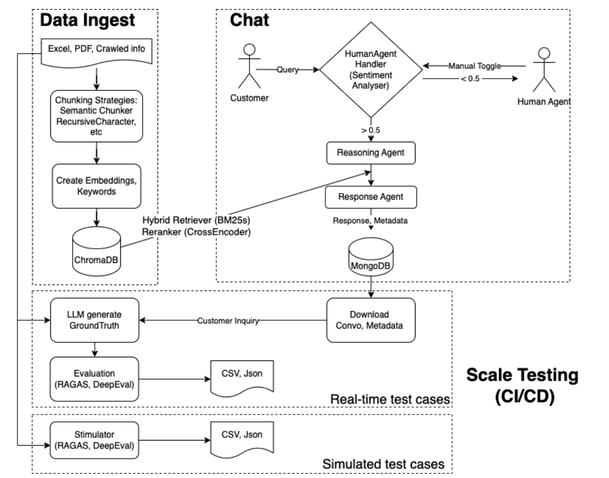

# Edu Chatbot

<div align="center">
  
</div>

Edu Chatbot is a customer service chatbot application, created for education enrichment businesses to auto-reply to customer inquiries. It manages customer inquiries across multiple channels including websites, WhatsApp, WeChat, Telegram, and more.

## Updates (13May2025):
* Main application "Edu Chatbot" is ready! Follow the Setup Guide to play with it. 
* Currently in the process of building a separate applicaiton for chatbot creator, which is designed to create a chatbot dynamically with user's instructions. 

## Overview & Key Features
Edu Chatbot combines AI technologies with human oversight to ensure customer satisfaction and improve sales conversion:
* **<span style="color:#4285F4">🤖 Intelligent Interaction</span>**: Leverages on Retrieval-Augmented Generation (RAG) to respond to complex customer inquiries, customization according to business needs.

* **<span style="color:#4285F4">📚 Knowledge Base</span>**: Stores and indexes frequently asked questions (FAQs), course details, pricing information, information crawled from company website and other business-critical data in a vector database for rapid, accurate retrieval.

* **<span style="color:#4285F4">🎯 Personalized Recommendations</span>**: Gathers relevant student information such as age and interests to recommend the relevant course.

* **<span style="color:#4285F4">🧠 Intent Classification</span>**: Identifies customer needs to provide targeted responses.

* **<span style="color:#4285F4">😊 Sentiment Analysis</span>**: Detects customer satisfaction levels and able to escalate to human staff when reaching a pre-configured threshold.

* **<span style="color:#4285F4">🧩 Custom Conversation Simulator</span>**: Takes on parent role, generating realistic queries and follow-up questions. Creates customizable datasets with varying personas and complexity for pre-deployment testing and CI/CD monitoring during production phase.

* **<span style="color:#4285F4">📊 Comprehensive Evaluation</span>**: A spectrum of evaluation metrics for single-turn and multi-turn conversations.

* **<span style="color:#4285F4">👨‍💼 Human-in-the-Loop Design</span>**: Ensures quality customer service through a sophisticated handoff system that activates when:
    1. A customer explicitly requests to speak with a human representative
    2. The sentiment analysis module detects customer frustration or dissatisfaction
    3. Staff members proactively choose to intervene via the support dashboard

* **<span style="color:#4285F4">🔄 Seamless Handoff</span>**: Enables staff to take over conversations when needed and return control to the chatbot once complex issues are resolved.

* **<span style="color:#4285F4">📱 Dual Interface</span>**: Features a comprehensive demonstration UI with customer-facing chat (left panel) and staff support dashboard (right panel) views.

<div align="center">
  
</div>

## Demo
Check out Edu Chatbot in action: [YouTube](https://youtu.be/nDMpLLQesEk)

To help you understand what's happening in the demo video, below is a write-up to illustrate the complete interaction flow:
```text
The flow begins when a customer inquires about courses through a chatbot. The chatbot classifies the intent and gathers key information such as the student's age and interests. Based on the inputs, it recommends suitable courses along with details like descriptions, teacher profiles, pricing, and schedules. When the customer expresses concern about the price and requests a discount, the chatbot informs them it isn't authorized to offer one. A support staff monitoring the conversation then intervenes by clicking a "Take Over" button and offers a special discount. The customer accepts, and the staff hands the conversation back to the chatbot, which proceeds with enrollment, completing the interaction smoothly.
```


## Setup Guide

### Prerequisites
* Python version 3.12+
* Docker Desktop

### Installation
1. Clone the repository
```bash
git clone https://github.com/Jeanetted3v/edu_chatbot.git
cd edu-chatbot
```
2. Configure environmental variables
* Key variables you need: at least 1 LLM api key and a MongoDB URI
* For the rest, you can put in placeholders such as "api_key" so that the system can still run. 
```bash
cp .env.example .env
# Edit .env file with your API keys and configurations
```


### Data Configuration - Local
* Place your unstructured FAQ documents (PDF) and structured data Excel files in the /data/data_to_ingest folder
* In config/data_ingest.yaml, configure the paths under "local_docs" according to the file names and excel sheet names
* Currently only support text information.
```yaml
local_doc:
  paths:
    - path: ./data/data_to_ingest/excel.xlsx
      sheet: syn_data
    - path: ./data/data_to_ingest/rag_qna.pdf
```
* In config/data_ingest.yaml, configure the chromadb collection name accordingly, default is set to "syn_data"
```yaml
embedder:
  similarity_metric: cosine
  persist_dir: ./data/embeddings
  collection: syn_data
  vector_store: chromadb
```

### Data Configuration - Gdrive (Temporarily disabled)
* Or configure Google Drive access
* Generate and download Google Drive API credentials JSON file
* Place your credentials file in a secure location
* In config/data_ingest.yaml, configure the Google Drive settings:
```yaml
gdrive:
  credentials_path: /path/to/your/credentials.json   # Path to your Google API credentials JSON file
gdrive_doc:
  - file_id: abcd123efg456                           # ID from Google Sheets URL
    file_type: sheets                                # For Google Sheets documents
  - file_id: abcd123efg456                           # ID from Google Docs URL
    file_type: docs                                  # For Google Docs documents
  # - file_id: your_drive_pdf_file_id_here
  #   file_type: pdf   # Support for PDF files (coming soon)
```
* File IDs can be found in Google Drive URLs:
  * For Google Sheets: https://docs.google.com/spreadsheets/d/FILE_ID_HERE/edit
  * For Google Docs: https://docs.google.com/document/d/FILE_ID_HERE/edit
  * For Drive files: https://drive.google.com/file/d/FILE_ID_HERE/view

### Other configurable parameters
* Other configurable parameters such as LLM model, retreiver settings, prompts can be found in yaml files in the config/folder. 
* Main entry point for configurable parameters for the chatbot is at config/config.yaml
* Main entry point for configurable parametes for the data ingestion pipeline is at config/data_ingest.yaml
* Users feel free to change them or just use the current default settings. 

### Running the app
1. Start the application using Docker Compose
```bash
docker compose up --build
```
2. Access the application
* Open in a web browser to interact with the [chatbot (dual interface)](http://localhost:3000) (port 3000).
* Or if you are familiar with SwaggerUI inference, feel free to interact directly with the [Backend](http://localhost:8000/chat/docs) (port 8000).


## Technical Implementation Details
**<span style="color:#4285F4">📏 RAG or Long Context?</span>**
- In view of recent advancement in LLM's context window, this chatbot is set up to use LLM to retreive information if data is within a certain token count. If token count is over a certain number, we'll fall back to use RAG instead. 
- Token count is set as a configurable parameter in config/data_ingest.yaml

**<span style="color:#0F9D58">📂 Loading documents from Local or Google Drive</span>**
- Education company can either load data into Google Drive or locally for both structured and unstructured data ingestion.
- This can be configured in config/data_ingest.yaml

**<span style="color:#F4B400">✂️ Chunking</span>**
- Various chunking strategies are configurable in the config/data_ingest.yaml file. 
- Currently Langchain is used for RecursiveCharacter and SemanticChunker chunking stratgies for the RAG pipeline.

**<span style="color:#DB4437">🔍 Embedding, Vector Database & Retrieval</span>**
- Implements ChromaDB for lightweight, high-performance vector storage.
- Utilizes BM25 for efficient full-text keyword search, enabling robust lexical matching alongside semantic retrieval.
- Applies CrossEncoder as a reranker to refine and boost relevance of retrieved results through deeper contextual scoring.

**<span style="color:#9C27B0">🤖 Modular Agentic RAG</span>**
- PydanticAI is used here for its simplicity and data valiadation feature.
- Also implemented PydanticAI logfire for LLM tracing.
- Able to provide a more deterministic structured output, such as during intent classification process. 
- For other LLM functions, plain vanilla OpenAI API is used for simplicity and flexibility. 
- Incorporates a separate **Reasoning Agent** to elaborate on incoming query, assess whether the intent needs to be split into multiple intent and thus retrieval, and determine if RAG is required.
* A **Response Agent** then synthesizes incoming query, chat history, and any retrieved documents to generate the final customer response. This modular approach optimizes latency, reduces unnecessary retrieval calls, and improves the relevance and coherence of responses.

**<span style="color:#FF9800">💾 Saved Chat History</span>**
- All chat histories are saved in MongoDB, which allows for tracing, further analysis and prompt enhancements.

<span style="color:#E91E63">📊 Evaluation</span>
- Ragas: Metrics include answer relevancy, faithfulness, context precision, answer correctness.
- DeepEval: Conversational metrics are also used here since it involves multi-turn conversations.
- Evaluation results are logged for continuous improvement of the system.


## Ideas for Future Enhancements
1. **Multi-Channel Integration**
- Implement direct integration with WhatsApp, WeChat, Telegram, and other messaging platforms
- Develop a unified API layer for consistent experience across all communication channels
- Enable channel-specific customizations while maintaining core functionality

2. **Vector Database**
- To support more types of vector database

3. **MultiModal data**
- To support MultiModal data RAG

4. **Enhanced Evaluation**
- To add customized evaluation metrics


## Project Structure
```text
Edu_chatbot/
├── assets/
├── config/
├── data/
│   ├── raw/
│   └── embeddings/
├── dockerfiles/
├── src/
│   ├── backend/
│   │   ├── api/
│   │   ├── chat/
│   │   ├── database/
│   │   ├── dataloaders/
│   │   ├── dataprocessor/
│   │   ├── evaluation/
│   │   ├── main/
│   │   ├── models/
│   │   ├── utils/
│   │   └── websocket/
│   └── frontend/
│       └── src/
│           └── app/
│               ├── components/
│               ├── services/
│               └── page.tsx
├── .dockerignore
├── .env
├── .gitignore
├── docker-compose.yml
├── README.md
├── requirements.in
└── requirements.txt
```


## Tech Stack
**<span style="color:#4285F4">🧠 OpenAI</span>**: LLM provider for natural language understanding and generation  
**<span style="color:#0F9D58">🔍 PydanticAI</span>**: Agentic framework for data validation and structured outputs   
**<span style="color:#F4B400">⛓️ Langchain</span>**: Document processing and chunking  
**<span style="color:#DB4437">😊 Vadar</span>**: Sentiment analysis  
**<span style="color:#9C27B0">🔠 ChromaDB</span>**: Vector database for semantic search  
**<span style="color:#FF9800">💾 MongoDB</span>**: Chat history storage and data persistence  
**<span style="color:#3F51B5">📁 GoogleDriveAPI</span>**: Remote data access and integration  
**<span style="color:#00BCD4">⚡ FastAPI</span>**: Backend API framework, HTTP and Websocket. Websocket is for real-time communications, catering for this use case. 
**<span style="color:#795548">⚛️ NodeJS/React</span>**: Used for building the frontend interface for chat interaction, and user dashboard
**<span style="color:#9E9E9E">📚 BM25</span>**: Traditional keyword-based retriever for efficient sparse search
**<span style="color:#607D8B">🔍 CrossEncoder</span>**: Reranker used after initial retrieval to improve response relevance
**<span style="color:#607D8B">🐳 Docker</span>**: Containerization and deployment  
**<span style="color:#E91E63">📊 RAGAS</span>**: RAG evaluation framework for measuring relevancy, faithfulness, correctness  
**<span style="color:#F48FB1">📊 DeepEval</span>**: Evaluation framework for measuring conversational metrics such as role adherence, knowledge retention, conversation completeness, and relevancy


## Reference
1. [Klarna Chatbot Strategy Shift: Why Companies Are Rebalancing Human and AI Customer Service](https://loris.ai/blog/klarna-chatbot-strategy-shift-why-companies-are-rebalancing-human-and-ai-customer-service/)


## Contributing
Contributions are welcome! Please feel free to submit a Pull Request.

## License
[MIT License](LICENSE)